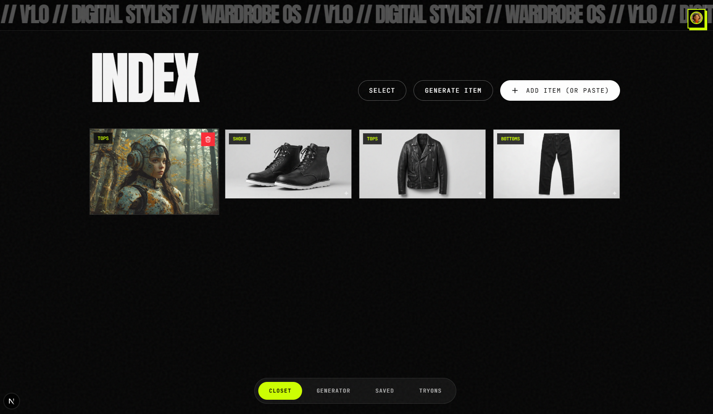

# Digital Closet

Welcome to the **Digital Closet** project! This repository contains the source code for managing your digital wardrobe.



## 🌟 Features
* **Wardrobe Management**: Digitally organize your clothing and accessories.
* **Frontend Design**: Modern, responsive user interface.

## 🚀 Getting Started

### Prerequisites
Make sure you have the following installed:
* Node.js (v16 or higher)
* npm or yarn

### Installation
1. Clone the repository:
   ```bash
   git clone <your-repo-url>
   ```
2. Navigate to the project directory:
   ```bash
   cd digital-closet
   ```
3. Install dependencies:
   ```bash
   npm install
   ```

## 🛠️ Usage
To run the application locally, start the development server:
```bash
npm start
```

